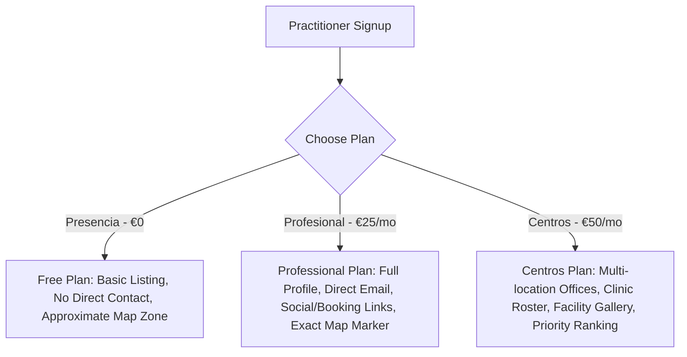
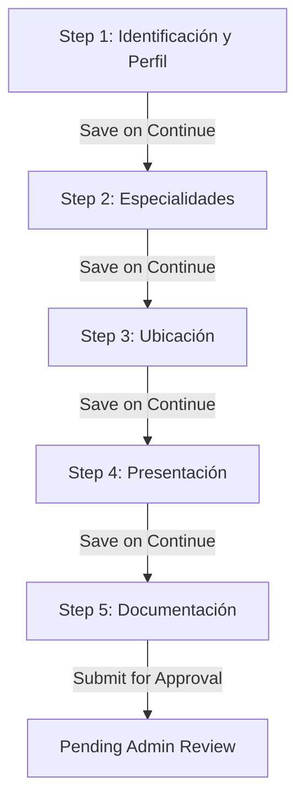

# 🌿 Mallorca Holística: Comprehensive System & Architecture Documentation

**Last Updated**: June 28, 2026  
**Target Audience**: Developers, Platform Operators, and QA/Product AI Agents  

Welcome to the canonical system documentation for **Mallorca Holística**. This document details the technical implementation, business logic, system integrations, development history, and recent upgrades of the platform. It is formatted specifically to help AI agents quickly digest the system context, execute targeted audits, test functionality, and propose architectural/business-model testing strategies.

---

## 📖 Table of Contents
1. [Project Overview & Vision](#1-project-overview--vision)
2. [Business Model & Monetization Architecture](#2-business-model--monetization-architecture)
3. [Recent Developments (Created, Fixed, and Adapted)](#3-recent-developments-created-fixed-and-adapted)
4. [User Onboarding & Progressive Profile Wizard](#4-user-onboarding--progressive-profile-wizard)
5. [Advanced Dashboard & Profile Management](#5-advanced-dashboard--profile-management)
6. [Interactive Mapbox GL Directory Integration](#6-interactive-mapbox-gl-directory-integration)
7. [Stripe Subscription & Billing Engine](#7-stripe-subscription--billing-engine)
8. [Authentication & Communications (Supabase + Resend)](#8-authentication--communications-supabase--resend)
9. [Database Schema & Backend Architecture](#9-database-schema--backend-architecture)
10. [Edge Functions & Search AI Systems](#10-edge-functions--search-ai-systems)
11. [AI QA Agent Guidelines & Proposed Test Scenarios](#11-ai-qa-agent-guidelines--proposed-test-scenarios)
12. [Strategic Technical & Business Improvements Roadmap](#12-strategic-technical--business-improvements-roadmap)

---

## 1. Project Overview & Vision

### What is Mallorca Holística?
Mallorca Holística is a premium, high-fidelity online marketplace, search engine, and directory connecting holistic health practitioners, wellness centers, and organic therapy seekers on the island of Mallorca, Spain. 

### Why was it built?
Traditional medical directories often exclude or fail to represent holistic, alternative, and natural wellness therapists appropriately. Mallorca Holística serves as a highly localized, specialized directory designed with an organic, warm terracotta-and-cream aesthetic matching the serene nature of Mallorca's wellness ecosystem.

### Core Goals
- **Empower Practitioners**: Give therapists and clinics a premium dashboard to publish rich public profiles, credentials, location cards, and service offerings.
- **Bridge Conversational Gaps**: Connect seekers with appropriate specialists using natural language symptom processing (conversational AI search).
- **Establish Visual Premiumness**: Ensure the frontend looks alive, highly premium, responsive, and visually harmonious across all viewports.

---

## 2. Business Model & Monetization Architecture

The platform supports a subscription-based SaaS model with three service tiers. Access to direct communication, contact info, and visibility features on a practitioner's public profile is controlled dynamically by their active plan.



### A. Subscription Tiers

| Tier Name | Slug | Price (Standard) | Features & Visibility Rules |
| :--- | :--- | :--- | :--- |
| **Presencia** (Free) | `presencia` | **€0/month** | Basic database indexing. Profile displays **only** a direct "Contacto directo" call card with their phone number. Advanced contact forms, website redirects, booking links, and review badges are locked. |
| **Profesional** | `profesional` | **€25/month** | Complete profile features. Unlocks secure direct-email inquiry forms, direct website redirects, custom booking links (e.g. Calendly/Acuity), and educational credential verification badges. |
| **Centros** | `centros-organizadores` | **€50/month** | Fully loaded tier for wellness centers, cooperatives, and clinics. Adds multi-location physical office management, team member rosters, facility photo galleries, and priority search results ranking. |

### B. Special "Founder Member" Cohort
To reward the platform's initial adopters, a **Founder Member** pricing exception ruleset is hardcoded into the platform, capped at **40 professionals** and **10 centers**:
- **System Indicator**: Managed via the boolean column `public.therapists.is_founder`.
- **180-Day Free Trial**: Founder members receive a **6-month free trial** (€0 charge) upon signup to explore the platform and load their credentials risk-free.
- **Lifetime Promotional Pricing**:
  - **Professional Founders**: Permanently discounted to **€15/month** (down from €25).
  - **Center Founders**: Permanently discounted to **€35/month** (down from €50).
- **Premium Panel Branding**: In the billing view (`src/routes/dashboard/billing.tsx`), founder practitioners are welcomed with an elegant gold-accented card, a 👑 badge, and clear struck-through pricing (e.g. `~~25,00 €/mes~~` -> `15,00 €/mes`).

---

## 3. Recent Developments (Created, Fixed, and Adapted)

Over the recent development cycles, several critical features have been created, fixed, and adapted to ensure the platform operates seamlessly:

### A. Map Integration & Geolocation (Created & Fixed)
*   **Interactive Geolocation Markers**: Integrated Mapbox GL into the public profile rendering under `SingleProfessionalMap.tsx`.
*   **Translucent Approximate Zones**: For profiles on the Free ("Presencia") plan, or profiles without an exact street address, exact physical coordinates are hidden. Instead, the map renders a beautifully stylized, translucent, pulsing circular zone centered on the municipality coordinates, protecting practitioner privacy while informing visitors of their approximate location.
*   **Graceful API Key Fallbacks**: If the Mapbox access token is absent or invalid, the component renders a elegant diagnostic container outlining resolution steps rather than crashing the client interface.

### B. Municipality Coordinates Fallback Dictionary (Created & Adapted)
*   **Municipality Database Resolution**: Created [src/lib/municipality-coordinates.ts](file:///Users/charles.santana/Kultrip/gemini-dev/mallorca-health-connect/src/lib/municipality-coordinates.ts) containing exact latitude and longitude coordinates for all 53 municipalities in Mallorca.
*   **Seeding & Direct Execution**: Created and executed `scripts/update-live-municipalities.mjs` which successfully seeded the live Supabase instance with all municipality coordinates.
*   **Defensive Fallback Logic**: Added code in `ProfessionalProfilePage.tsx` and `professional-map-utils.ts` that automatically falls back to this hardcoded coordinates dictionary if database queries return null/empty coordinates, preventing map rendering errors if developers reset or partially seed databases.

### C. WhatsApp Contact Button Upgrades (Fixed & Adapted)
*   **Direct Contact Integration**: Modified `ProfessionalProfilePage.tsx` to render the primary "Hablar por WhatsApp" CTA buttons and sidebar contact options for premium paid profiles (and fallback profiles) using their `whatsapp` number, falling back automatically to their primary `phone` number if the dedicated `whatsapp` field is empty.
*   **Seamless Usability**: Tying the WhatsApp action directly to either number ensures paid practitioners (who paid specifically to unlock the direct WhatsApp communication channel) always have a highly visible WhatsApp CTA button on their profiles, even if they forgot to toggle the manual `show_whatsapp_public` setting in their dashboard editor.

---

## 4. User Onboarding & Progressive Profile Wizard

Practitioners complete a high-fidelity, 5-step registration wizard (`src/routes/onboarding.tsx`) designed defensively against data loss.



### Technical UX Features
1. **Advanced Step-by-Step Auto-Save**: At every step change (clicking "Atrás" or "Guardar y continuar"), the wizard fires a background save operation (`saveDraftProgress()`). This uploads selected media to Supabase Storage, upserts form fields to the database with `status: "draft"`, and logs the user's progress.
2. **Automatic Session Restoration**: On page load, the system retrieves `furthest_onboarding_step` from user metadata and automatically redirects the user to their furthest completed step, pre-populating all loaded state fields.
3. **Circular Upload Box Previews**: File upload containers for profile photos and organization logos support dynamic local previews. On image selection, they generate clean circular masks and shadow offsets using `URL.createObjectURL(file)`, with memory cleanup hooks (`URL.revokeObjectURL(url)`) called on unmount.
4. **Relaxed Location Rules for Free Tier**: On Step 3 (Location), practitioners on the Free plan are only required to specify their **Municipio**. *Nombre del centro* and *Dirección* are optional. If left blank, the backend gracefully defaults the center name to `"Consulta"` with a generated unique slug to preserve database reference integrity without breaking the user experience.

---

## 5. Advanced Dashboard & Profile Management

The private dashboard (`/dashboard`) hosts the **Mi Perfil** tab, which acts as a rich profile builder.

### A. Live Public Header Preview
Rather than a static profile image preview, the form renders a spectacular, full-width **landscape preview banner** (`ProfileEditor.tsx`) that behaves as a live, high-fidelity replica of the public directory's header:
- **Background Visuals**: Integrates the serene public profile branch image (`heroImg`) over a warm cream gradient overlay.
- **Overlapping Badge Mask**: Features a circular photo frame wrapped in white borders, topped with an absolute professional logo overlay on the left and a terracotta organic leaf icon badge on the bottom-right.
- **Dynamic Content Injection**: Synchronizes inputs in real-time. As practitioners type, their **Full Name**, **Professional Name/Title**, and **Tagline/Headline** update instantly.
- **Dynamic Location Resolution**: Observes the selected Municipality dropdown and resolves its name (e.g. "Bunyola") inside a pill indicator using a reactive lookup.

### B. Defensive Form Configuration Limits
Form limits prevent layout breakages across all plans:
*   **Frase de presentación**: Max 120 characters.
*   **Presentación**: Max 3000 characters.
*   **Mi enfoque**: Max 2000 characters.
*   **Qué me diferencia**: Max 1000 characters.
*   **Input Stability**: All dynamic array loops (such as clinics, office list locations, or team members) use stable, index-derived keys (`key={index}` or `key={location.id ?? index}`) to prevent keyboard focus loss on keystroke changes.

---

## 6. Interactive Mapbox GL Directory Integration

The directory results page features a high-fidelity split-screen layout displaying matching practitioners alongside an interactive Mapbox GL map (`src/components/therapists/ProfessionalsMap.tsx`).

### Engineering Details
- **Thematic Style**: Mapbox loads the refined, light theme style (`mapbox://styles/mapbox/light-v11`) to blend into the organic cream theme of the application.
- **Interactive Pins**: Custom HTML markers are injected into the map canvas using Mallorca Holística's signature terracotta brand color (`#8a6550`).
- **Dynamic Bounds Scaling**: When results change, the map collects the active coordinate array and calculates bounds dynamically, triggering a smooth `.fitBounds()` animation to auto-zoom and contain all matched specialists.
- **Rich Popup Overlays**: Clicking a pin opens a beautifully styled popover inside the map. The popover displays the therapist's circular profile photo, fallback initial badge (if no image is present), name, specialty/headline, municipality name, and a direct "Ver perfil" action button routing safely to their public details view.

---

## 7. Stripe Subscription & Billing Engine

The platform manages billing and checkout workflows securely using the Stripe Node.js SDK and Stripe.js on the client.

### A. Price Mapping & Checkout Routing
Depending on whether `therapists.is_founder` is true or false, the billing router maps the subscription intent to different Stripe API price IDs:

```
                  +--------------------------------+
                  |  Therapist Billing Page Click  |
                  +--------------------------------+
                                  |
                        Is Founder Member?
                       /                  \
                     YES                  NO
                     /                      \
      +-----------------------------+    +------------------------------+
      | - Use Founder Price ID      |    | - Use Standard Price ID      |
      | - Inject 180-Day Free Trial |    | - No Free Trial              |
      +-----------------------------+    +------------------------------+
                     \                      /
                  +--------------------------------+
                  | Redirect to Stripe Checkout UI |
                  +--------------------------------+
```

### B. Webhook Lifecycle Management
The backend Edge Function (`supabase/functions/stripe-webhook`) listens for critical subscription events to update the therapist database record:
1.  `checkout.session.completed`: Locates the therapist matching the email or user ID stored in checkout metadata, flags them as subscribed, and maps the active `stripe_subscription_id`.
2.  `customer.subscription.created` & `customer.subscription.updated`: Inspects the active plan product ID and updates the corresponding membership level in `therapists.plan_slug`.
3.  `customer.subscription.deleted`: Gracefully transitions the therapist's plan to `presencia` (Free), removing premium visibility features without deleting their profile data.

---

## 8. Authentication & Communications (Supabase + Resend)

Platform authentication, database rules, and email delivery are coupled to maintain a white-labeled ecosystem.

### A. Secure Branded Transactions
Default Supabase authentication email templates are bypassed to avoid sending raw Supabase links. Signups, password resets, and confirm links trigger a secure function that interacts with the **Resend API**:
- Transactional templates are built with responsive HTML/CSS using the branding color palette (`#f4eadb`, `#1f3326`).
- Mail is securely routed from `hola@mallorcaholistica.com` (or authorized Resend domain handles).

### B. Administrator Notification Flow
Critical administrator interactions are routed directly to the fallback address **`mallorcaholistica11@gmail.com`**:
- When a practitioner completes Step 5 of onboarding, an email alert notifies the admin that a credentials package is pending review.
- The admin logs in, reviews the credentials, and toggles their profile to **Active** status.

---

## 9. Database Schema & Backend Architecture

The application is powered by PostgreSQL hosted on Supabase, secured with Row-Level Security (RLS) policies.

```
        +------------------+                   +--------------------+
        |    therapists    |*---------------1  |       plans        |
        +------------------+                   +--------------------+
                 |                                       |
                 |*                                      |*
        +------------------+                   +--------------------+
        |     centers      |                   |  analytics_events  |
        +------------------+                   +--------------------+
```

### Key Tables Overview

#### 1. `public.therapists`
Main table representing practitioners.
- `id` (uuid, primary key, references `auth.users`)
- `full_name` (text, not null)
- `professional_name` (text, nullable)
- `tagline` / `frase_clave` (text, max 120 chars)
- `photo_url` / `logo_url` (text, references Supabase Storage bucket)
- `phone` (text, optional) / `whatsapp` (text, mandatory)
- `plan_slug` (text, references `plans`)
- `is_founder` (boolean, defaults to `false`)
- `status` (text: `"draft"`, `"pending_review"`, `"active"`)

#### 2. `public.centers`
Represents physical clinics or office locations.
- `id` (uuid, primary key)
- `therapist_id` (uuid, references `therapists`)
- `name` (text, not null - falls back to `"Consulta"` for free plan)
- `address` (text, optional)
- `municipality_id` (uuid, references `municipalities`)
- `slug` (text, unique)

#### 3. `public.plans`
Stores subscription pricing details.
- `slug` (text, primary key)
- `name` (text, not null)
- `price_cents` (integer)
- `stripe_price_id` (text)
- `founder_price_monthly_cents` (integer)
- `founder_stripe_price_id` (text)

---

## 10. Edge Functions & Search AI Systems

The platform hosts two key Supabase Edge Functions:

### 1. `stripe-webhook`
- Handles subscription events from Stripe.
- Directs database updates in `therapists` regarding active billing status.

### 2. `symptom-search`
Provides conversational search capabilities.
- Accepts natural language inputs (e.g. *"Sufro de ansiedad y problemas de espalda en Inca"*).
- Uses vector embeddings (or text keyword mapping) to match the input to platform `help_areas`.
- Searches for active professionals associated with matched help areas.
- Logs queries inside `public.ai_search_queries` and search impression actions in `public.analytics_events` for market behavior analysis.

---

## 11. AI QA Agent Guidelines & Proposed Test Scenarios

If you are an AI QA agent or testing framework tasked with designing and running tests for Mallorca Holística, you **must** center your test cases on the platform's core business model, active subscription limitations, and user registration flows.

Here are the highest priority test scenarios grouped by functional boundaries:

### A. Subscription Access & Boundary Testing (Critical)
1.  **Free ("Presencia") Profile Contact Restrictions**:
    *   **Objective**: Confirm that a practitioner on the Free plan does *not* display advanced contact features.
    *   **Test Case**: Log in as a Free practitioner. Verify that their public profile shows the approximate location zone and displays *only* their phone number for calling. Direct email forms, custom booking URLs, and social links must *not* render.
2.  **Professional ("Profesional") Profile Contact Promotion**:
    *   **Objective**: Verify that upgrading to Professional successfully unlocks advanced contact fields.
    *   **Test Case**: Set a practitioner's plan to `profesional`. Verify that their public profile renders the direct email inquiry form, website redirects, booking links (Calendly, etc.), and the verification badge.
3.  **WhatsApp Visibility Logic**:
    *   **Objective**: Ensure that premium paid profiles display the WhatsApp button seamlessly.
    *   **Test Case**: Log in as a Professional. Verify that the "Hablar por WhatsApp" CTA is present in the public profile header and sidebar even if `show_whatsapp_public` is false, falling back to using their `phone` number if the `whatsapp` field is empty.

### B. Founder Member Trial & Billing Testing
1.  **Founder Free Trial Injection**:
    *   **Objective**: Verify that founder accounts receive the 180-day free trial on Stripe Checkout.
    *   **Test Case**: Navigate to the billing dashboard with `is_founder` set to true. Click upgrade. Confirm that the redirected Stripe Checkout page displays a €0 charge with a 6-month trial before billing commences.
2.  **Lifetime Founder Price Reduction**:
    *   **Objective**: Confirm that founders are billed at promotional rates (€15/month for Professional and €35/month for Centers) after the trial.
    *   **Test Case**: Verify that Stripe Session metadata contains the discount Price ID mappings corresponding to the founder pricing.

### C. Map Location and Zone Privacy Testing
1.  **Free Plan Approximate Circle Zone rendering**:
    *   **Objective**: Confirm exact coordinates are hidden for Free therapists.
    *   **Test Case**: Query a Free practitioner's map on the profile page. Verify that a translucent circular overlay is drawn on Mapbox GL instead of a pinpoint marker at their exact address, protecting privacy.
2.  **Paid Plan Exact Marker Pinpoint**:
    *   **Objective**: Ensure paid therapists display exact pinpoint locations on the map.
    *   **Test Case**: Query a Professional or Centros therapist with a published address. Verify that Mapbox renders an exact pinpoint marker, and clicking the marker reveals their office details popover.

---

## 12. Strategic Technical & Business Improvements Roadmap

If you are an AI Agent auditing this repository, here are high-impact feature branches and enhancements that would improve the Mallorca Holística platform.

### A. Architectural & Technical Enhancements
1.  **Strict Vector Search**: Upgrade `symptom-search` from simple keyword/catalog maps to true PostgreSQL pgvector embeddings. This allows matching semantic terms (like *"estrés"* matches the help area *"ansiedad"* or *"tranquilidad"*).
2.  **Optimized Media Delivery**: Implement automatic WebP compression on the client before uploading photos to Supabase Storage. This will reduce page load times for therapist profile screens.
3.  **Multilingual Support (i18n)**: Mallorca is a multi-cultural island. Implement Spanish, Catalan, English, and German localizations on public profile routes.

### B. Product & Monetization Features
1.  **Online Scheduler & Booking Center**: Add direct booking calendars inside the Mallorca Holística portal, allowing seekers to schedule appointments without leaving the site. The platform can take a small transactional commission (e.g. 2%).
2.  **Interactive Group Workshops & Events**: Enable "Centros" plan users to host, publish, and sell tickets to holistic workshops, yoga retreats, or courses directly from the platform.
3.  **Review Moderation Queue**: Add a moderation workflow in `/dashboard/admin` so reviews must be validated by an administrator before appearing on a practitioner's public page, preventing spam or abuse.
